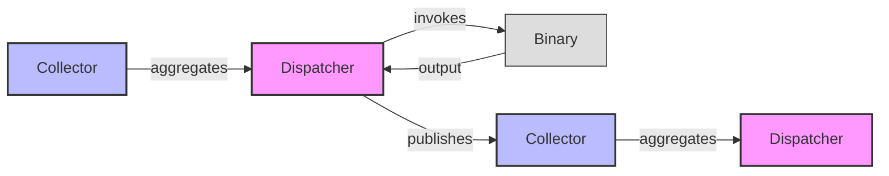
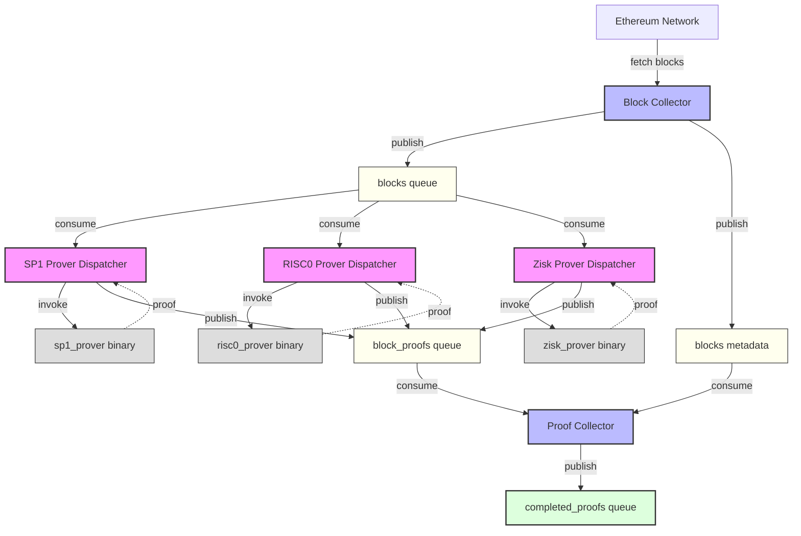

# Zircuit Orchestrator

An orchestration framework for composing zkProof pipelines using dispatchers and collectors. This demo uses NATS for message passing.

## Requirements

- Docker & Docker Compose
- [Foundry](https://book.getfoundry.sh/getting-started/installation) (`cast` for block queries)

## Examples

All examples share the same core infrastructure ([core-docker-compose.yml](compose/core-docker-compose.yml)):
- **NATS**: Message broker with JetStream
- **block-collector**: Fetches Ethereum blocks and publishes to queue
- **proof-collector**: Matches blocks with their proofs

### 1. Multi-Prover Setup ([docker-compose-ethproofs.yml](compose/docker-compose-ethproofs.yml))
```bash
make start-services
```
Demonstrates **parallel proving** with different proof systems. Runs SP1, RISC0, and Zisk provers simultaneously. Each prover has a **unique consumer name**, meaning every block is processed by all three provers independently.

**Use case**: Generate multiple proofs for the same block using different proving systems.

### 2. Workload Splitting ([docker-compose-split-work.yml](compose/docker-compose-split-work.yml))
```bash
make start-split-work
```
Demonstrates **horizontal scaling** for a single prover type. Runs multiple mock prover instances with the **same consumer name**, distributing blocks across instances via NATS consumer groups—each block is processed by only one prover.

**Use case**: Scale proving capacity by adding more workers.

### 3. Single Mock Prover ([docker-compose-mock.yml](compose/docker-compose-mock.yml))
```bash
make start-mock-proving
```
Minimal setup with one mock prover for testing the pipeline without real proof generation.

**Use case**: Test pipeline flow and message routing.

### 4. AMD64 Architecture ([docker-compose-split-work-amd64.yml](compose/docker-compose-split-work-amd64.yml))
```bash
make start-split-work-amd64
```
Same as workload splitting but uses SP1 prover binaries compiled for `linux/amd64` (x86_64).

**Use case**: Run on AMD64 servers instead of ARM64.

### Stopping Services
```bash
make stop-services
```
Stops all services and removes containers and volumes.

## Custom Block Range

By default, pipelines start from the latest finalized Ethereum block. To specify a custom starting block:

```bash
export NEXT_BLOCK=23839700
docker compose -f compose/core-docker-compose.yml up -d
docker compose -f compose/docker-compose-ethproofs.yml up -d
```

## How It Works

The orchestrator models proving pipelines as a graph of **dispatchers** and **collectors**:

- **Dispatcher**: Consumes messages from a queue, invokes a binary with standardized I/O (`-i input.json -o output.json`), and publishes results to output queues
- **Collector**: Aggregates messages from multiple sources using configurable strategies (field matching, sequencing) and forwards to the next stage

This pattern enables arbitrary pipeline composition—dispatchers can invoke any binary (provers, preprocessors, aggregators), while collectors handle data dependencies and synchronization.

### Execution Model

Dispatchers use `JsonExecutor` to invoke binaries with JSON I/O. The executor interface is extensible—custom composers can read from arbitrary sources and route by message type.

### Dispatcher-Collector Pattern



### Pipeline Architecture


